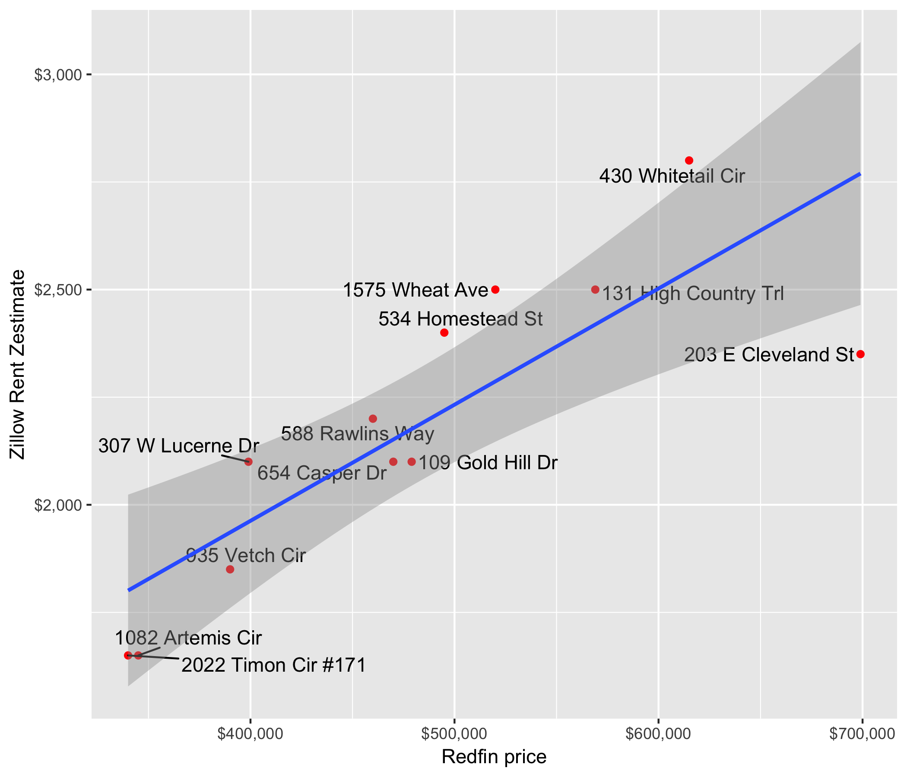

# House Data

We're currently doing a 1031 exchange which means we need to identify a replacement property within 45 days. That's not a lot of time.

In order to screen properties quickly, I wrote this (quasi-disposable) Java Spring app to collect recent listings from Redfin and rent estimates from Zillow.

The data is persisted in MySQL. Here's the DDL to create the table:

    CREATE DATABASE house_data;
    USE house_data;
    CREATE TABLE house_data (
        zpid BIGINT PRIMARY KEY,
        address VARCHAR(255),
        cityStateZip VARCHAR(255),
        price BIGINT,
        zestimate BIGINT,
        rentZestimate BIGINT
    );

There's an R script that creates a scatterplot:

